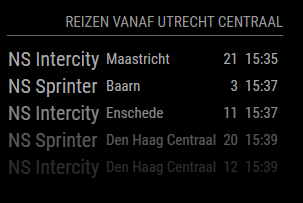

# Module: MMM-OvInfo

## Description
This Magic Mirror module shows Dutch train departures requested from the NS API.



## Installation
Clone this repository in you modules folder with:
`git clone https://github.com/mfurious/MMM-NsInfo.git`

## Configuration
To use this module, add the follwing configuration to your `config/config.js` file. This is an example for the departure times from Utrecht Central.

```javascript
modules: [
    {
        module: "MMM-NsInfo",
        position: "top_right",
        config: {
            station: "Utrecht Centraal",
            stationId: "UT",
            apiKey: "YOUR_API_KEY_HERE",
            maxDepartures: 5
        }
    },
}]
```

| Option | Description
|----------|-------------
|`module`   | Module Name. (See [MM Documentation](https://docs.magicmirror.builders/modules/configuration.html))
|`position` | Postion of the module. (See [MM Documentation](https://docs.magicmirror.builders/modules/configuration.html))
|`header`   | Title displayed. (See [MM Documentation](https://docs.magicmirror.builders/modules/configuration.html))
|`apiKey`    | Your NS API key.
|`station`   | The name of your station.<br><b>Type:</b> String <b>Default:</b> Utrecht centraal
|`stationId` | The ID of your station.<br> <b>Type</b> String <b>Default:</b> UT
|`maxDepartures`   | The maximum amout of departures shown on the dashboard.<br><b>Type</b> integer <b>Default:</b> 5
|`updateInterval`   | The amount of time between updates <i>(in minutes).</i>.<br><b>Type</b> integer <b>Default:</b> 5

This module is based on the NS API, you can request a key from [this website](https://apiportal.ns.nl/)

## Looking up Station ID codes
To lookup a Station ID, you can use to `stations.js` file. Make sure to set you API Key in stations.js itself, as it cannot access the config file variable.

## Disclaimer
Neither the author or NS are in any way reliable for inaccuracies and have no liabilities regarding usage of the module in any kind.

### Version info
v1.0.1
